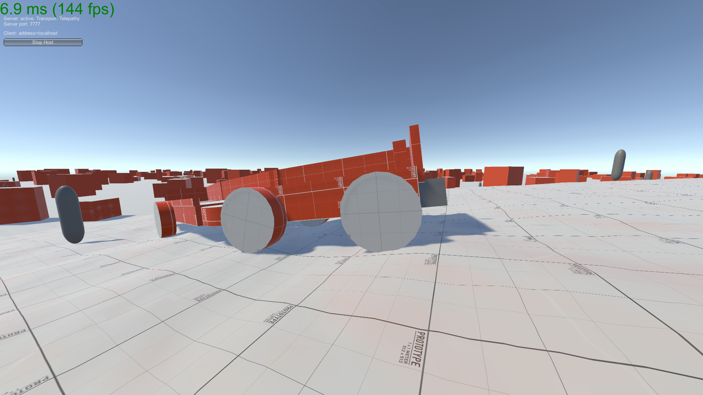

# NetworkedVehicleExperiment
A coding experiment I made sometime back in 2022 to learn some advanced networking in Unity.

This project uses Unity 2020.3.27f1 and Mirror as its networking solution.

Controls:
|Key|Action|
|:---|:---|
|Click|Lock/unlock mouse|
|E|Interact|
|W,A,S, and D|Move.|
|Space|Jump.|

Interact with the box at the front of the vehicle to start controlling it. Press again to stop driving.

### Some cool stuff I did with this project:
* The vehicle and its trailers are networked.
* The networked vehicle can be driven by the host or by a connected client and will behave mostly the same either way.
* The vehicle's movement is simulated on every players PC with just the driver's inputs being kept in sync. The vehicle's position is only corrected if it gets too far out of sync. (Dead reckoning)
* The dead reckoning is more tolerant of inaccuracy along the vehicle's moving direction than perpendicular to it. If a client's copy of the vehicle is a little bit behind the driver's copy the system will be more tolerant of this inaccuracy than if a client's copy is the same distance to the side and thus at risk of hitting an obsticle that would be missed on the driver's machine.
* Players can stand on the moving vehicle, and when it gets teleported to account for network inaccuracy the players move with it to prevent interuption.
* Other players will see eachother standing on the correct part of the vehicle, even when the vehicle is moving at speed or the other player is jumping in place on the vehicle while it's moving.
* The enemies chasing the player around the map can be pushed by the vehicle regardless of if the vehicle is being driven by a connected client or the host.
* The enemies lead the player's movement and try to get ahead of them. They can get on the vehicle. They're also very annoying.